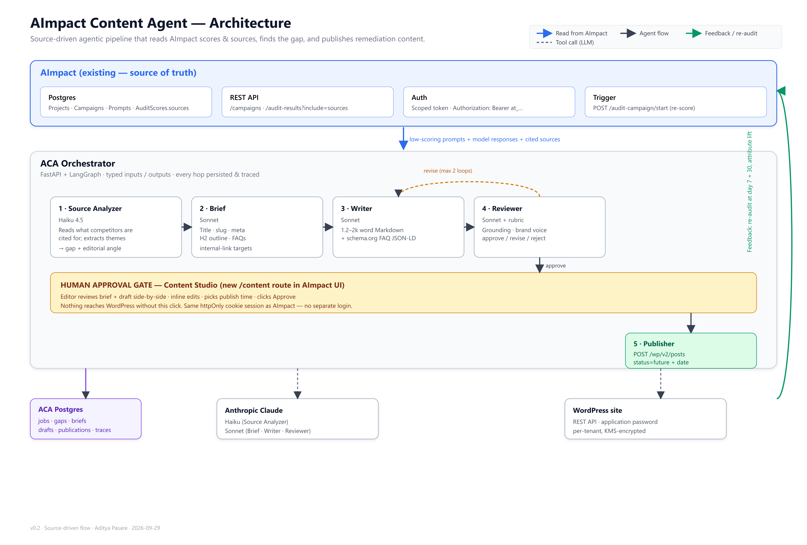

# 01 · Architecture



## What this diagram shows

The **static component map** of ACA. It answers: what pieces exist, who owns what, and what boundaries must never be crossed. The runtime dynamics (who calls whom, in what order) live in [02-workflow.md](02-workflow.md); the infra topology (which cloud service each box runs on) lives in [03-system-architecture.md](03-system-architecture.md); the code layout lives in [04-code-architecture.md](04-code-architecture.md).

Read the diagram top-down. Every arrow is a runtime dependency.

**v0.2 · source-driven flow.** The Keyword agent (Google Ads Keyword Planner) is gone. The Source Analyzer now reads what ChatGPT / Claude / Gemini / Google AI cite in their answers, and derives the editorial angle directly from those citations. Five agents, not six.

---

## Zone 1 — AImpact (existing, source of truth)

The blue band at the top is the existing AImpact platform. ACA is a **consumer**, not a fork.

- **Postgres** — projects, campaigns, prompts, audit scores, users, subscriptions. The critical field for ACA is `AuditScore.sources` — the JSON blob each audit run stores, listing which URLs/pages the AI models cited when answering a prompt. ACA reads it *only* through AImpact's REST API. It never runs SQL against the AImpact DB.
- **REST API** — the primary read is `GET /campaigns/{id}/audit-results?include=sources`. The full endpoint list is in [08-integration-aimpact.md](08-integration-aimpact.md).
- **Auth** — AImpact issues a scoped Personal API Token (`Authorization: Bearer at_...`). One token per ACA tenant. Revocable independently. No shared JWT.
- **Trigger** — after publish, ACA calls `POST /audit-campaign/start` to re-score the covered prompts.

### Rule
> ACA never mutates AImpact tables directly. Every state change goes through AImpact's REST API so its quota system, billing, and scheduler stay authoritative.

---

## Zone 2 — Data flow into ACA

The blue arrow into the orchestrator carries **low-scoring prompts + per-model responses + cited sources**. Concretely: the JSON payload from `GET /campaigns/{id}/audit-results?include=sources` filtered to prompts under the score threshold. Each prompt row contains:

- `prompt_id`, `text`
- `per_model` — `{chatgpt, claude, gemini, google_ai}` → each with the assistant's answer text and its `sources[]` (URL, domain, competitor name, quoted excerpt)

This is the only inbound signal ACA needs. The whole pipeline is derived from it.

---

## Zone 3 — ACA Orchestrator (five agents)

The gray container is the ACA orchestrator — a **LangGraph state machine** running inside the ACA FastAPI service. It advances a typed `WorkflowState` through five agents in sequence.

- **1 · Source Analyzer** (Haiku 4.5) — first analyzes AImpact answers/citations, then fetches cited public pages and verifies candidate claims/themes against page text. It emits candidate themes separately from quote-verified themes, per-source verification status, and a cautious editorial angle. Without the target site's page inventory, verified competitor pages do not establish a content gap on that site.
- **2 · Brief** (Sonnet) — turns the gap and angle into a structured JSON brief: title, slug, meta, H2 outline, 4–6 FAQs, internal-link targets. No keyword step; the editorial angle drives the outline.
- **3 · Writer** (Sonnet) — expands the brief into a 1,200–2,000-word Markdown draft with an inline `schema.org` `FAQPage` JSON-LD block.
- **4 · Reviewer** (Sonnet + rubric) — scores the draft against factual grounding (must trace back to the cited sources or a brand source doc), brand voice, and structural completeness. Verdict: `approve | revise | reject`.
- **5 · Publisher** — pushes the approved, human-signed-off draft to WordPress as a scheduled post.

The **dashed amber arc** from Reviewer to Writer is the auto-revise loop. Up to 2 iterations. If Reviewer still rejects on the 3rd try, the job escalates to a human before publish.

### Why source analysis and not keyword research

- **Sources are already in AImpact**, at no additional cost or quota. Keyword Planner needs OAuth, a developer token, and per-tenant onboarding.
- **Citations are evidence to inspect, not proof by themselves.** The Analyzer checks source page text before treating a claim or theme as verified. Citations do not reveal the model's hidden selection reason or prove the target site's content is missing.
- **The angle is more actionable than a keyword.** "Contrast our intake flow with HIPAA-audited competitors" produces a better brief than "hipaa patient intake, volume 6600".
- **Cost drops.** No third-party quota, no OAuth complexity, no separate cache layer.

---

## Zone 4 — The human approval gate

The yellow band under the pipeline is **Content Studio** — a new `/content` route inside AImpact's existing Next.js app. It reuses AImpact's `AuthProvider` and the httpOnly cookie session, so editors do not sign in twice.

The editor sees the brief and the draft side by side, edits inline, picks a publish time, clicks Approve. Nothing reaches WordPress without this click.

### Rule
> No autonomous publish in v1. Product decision, not a technical limit. Revisit after 60 days of PoC data.

---

## Zone 5 — Publisher and WordPress

The green box below the gate is the Publisher agent. It calls `POST /wp/v2/posts` with `status=future` and the schedule the human picked. Never `status=publish` — always scheduled, so the human retains a rollback window between approval and go-live.

WordPress authentication is per-tenant **Application Password**, KMS-encrypted at rest in the `aca_tenants` table, never logged, never emitted in traces.

---

## Zone 6 — External tools (dashed lines)

Only two:

- **Anthropic Claude** — Haiku for the Source Analyzer, Sonnet for Brief / Writer / Reviewer. Prompt-caching for the brand-voice rubric and site style guide (~70% hit rate target).
- **WordPress site** — per tenant. One row in `aca_tenants` per site.

No Google Ads, no OpenAI. Everything the pipeline needs is either in AImpact (sources) or in Claude (LLM).

---

## Zone 7 — ACA Postgres (purple)

The purple box on the bottom-left is ACA's own Postgres schema, **separate** from AImpact's. Every hop persists its output before the next agent runs, so a crashed job resumes from where it left off.

Tables (7 total):

| Table | Purpose |
|---|---|
| `aca_tenants` | One row per AImpact tenant that has enabled ACA. |
| `aca_jobs` | One row per workflow run. |
| `aca_gaps` | Analyzer output: cited sources, themes, target angle, hypothesis. |
| `aca_briefs` | Brief agent output. |
| `aca_drafts` | Writer + Reviewer output, versioned per revision. |
| `aca_publications` | Publisher output + lift measurements. |
| `aca_agent_traces` | Per-hop trace: tokens, cost, latency, verdict. |

Details in [06-data-model.md](06-data-model.md).

---

## Zone 8 — The feedback loop (green arrow on the right)

After the post goes live, ACA schedules two re-audits — at day 7 and day 30 — by calling `POST /audit-campaign/start` on AImpact for the originating campaign. When the audit completes, ACA reads the new scores for the covered prompts and computes:

```
lift = new_score - baseline_score
```

That value lands in `aca_publications.lift_7d` and `.lift_30d`. Roll it up to see which sources and angles actually move the needle. This is how we prove PoC success.

---

## Boundaries at a glance

| Boundary | ACA side | Other side | Rule |
|---|---|---|---|
| AImpact API | REST client (`tools/aimpact.py`) | AImpact REST | Bearer `at_...` only, scoped, revocable |
| AImpact DB | never touched | AImpact Postgres | direct SQL is forbidden |
| Frontend | `/content` route | AImpact Next.js app | shared cookie, one app |
| Secrets | `security/secrets.py` | AWS KMS + Secrets Manager | plaintext creds never in DB, never in logs |
| Tenant data | `tenant_id` on every row | other tenants | row-level checks on every read |
| Publish target | `tools/wordpress.py` | tenant WP site | scheduled draft only, never immediate publish |

---

## Design questions that shaped this

**Why a sidecar service and not a module inside AImpact?**
Independent deployability, independent secrets, independent quotas, independent price plan.

**Why LangGraph and not homemade orchestration?**
Typed state, built-in checkpointer, easy conditional edges for the revise loop.

**Why Claude only?**
Haiku for triage is cheaper than any comparable model. Sonnet's prompt caching hits our brand-voice-rubric workload well (~70% cache reuse target). A second provider adds surface area without a compelling PoC reason.

**Why drop the Keyword agent?**
The cited sources already tell us where the gap is and what angle wins. Keyword Planner was solving a different problem (SEO discovery) than the one AImpact actually presents to us (GEO citation gaps). See "Why source analysis and not keyword research" above.

**Why is the human gate non-negotiable in v1?**
LLM-generated content that misrepresents the brand does more damage than a slow queue. Revisit after 60 days of PoC data.
