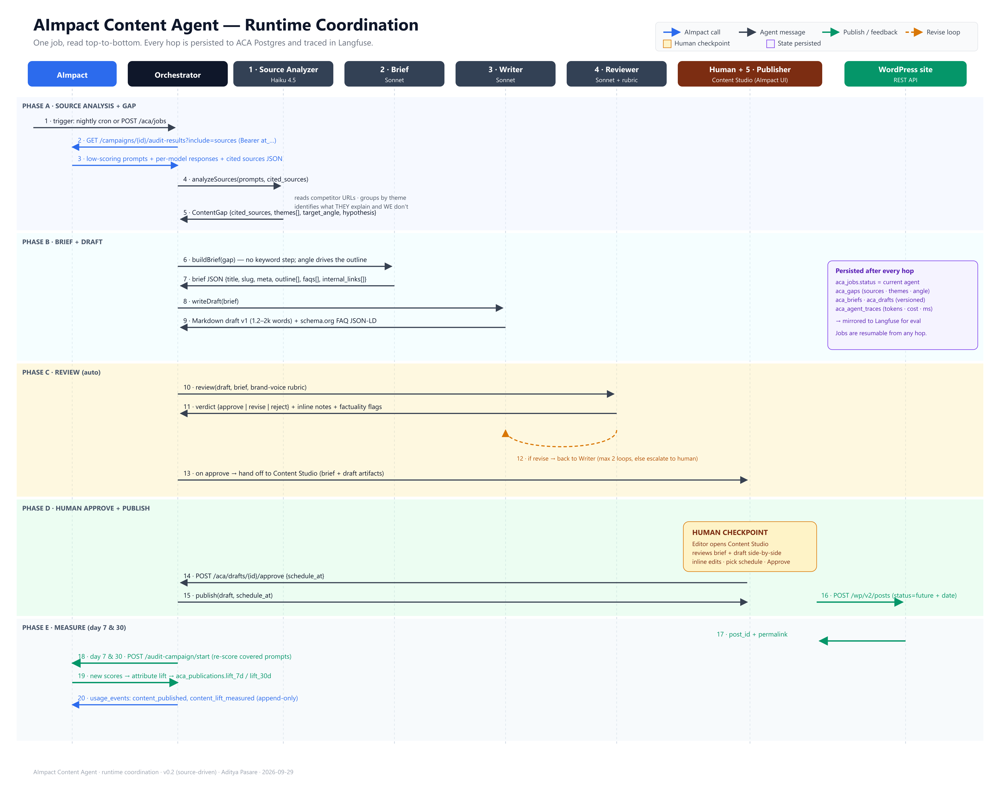

# 02 · Runtime Coordination (Workflow)



## What this diagram shows

The **dynamic sequence** of a single ACA job. Each of the 20 numbered hops is a real message between two components. Time flows top-to-bottom. Read the static component map first if you haven't: [01-architecture.md](01-architecture.md).

The diagram is grouped into five phases. Every hop persists state before the next runs — see the purple sidebar in the image and [06-data-model.md](06-data-model.md).

**v0.2 change:** Phase B (Keyword Research) is gone. The Source Analyzer produces the editorial angle directly from the citations, and Phase B is now "Brief + Draft".

---

## Phase A · Source Analysis + Gap

### 1 · Trigger enters Orchestrator
Two entry paths:
- **Nightly cron** — `workers/scheduler.py` runs at 02:00 IST and picks campaigns whose average score is under the tenant's threshold (default 60/100).
- **On-demand** — a human hits `POST /aca/jobs {campaign_id}` from Content Studio.

Either way, the runner creates an `aca_jobs` row with `status="pending"`, `current_agent=null`, and hands it to the LangGraph runner.

### 2 · Orchestrator → AImpact
```
GET /campaigns/{campaign_id}/audit-results?threshold=60&include=sources
Authorization: Bearer at_...
```
`include=sources` pulls the per-model citation JSON alongside each prompt's score. This is the whole input.

### 3 · AImpact → Orchestrator
Response payload (shape):
```json
{
  "prompts": [
    {
      "prompt_id": "cp_9182",
      "text": "best HIPAA-compliant patient intake software",
      "avg_score": 42,
      "per_model": {
        "chatgpt": {
          "answer": "For HIPAA-compliant intake, you'll want ...",
          "sources": [
            {"url":"https://acme.io/hipaa-checklist","domain":"acme.io","competitor":"Acme","excerpt":"Acme's compliance checklist ..."},
            {"url":"https://betaflow.com/soc2-blog","domain":"betaflow.com","competitor":"BetaFlow","excerpt":"..."}
          ]
        },
        "claude":   { "answer": "...", "sources": [...] },
        "gemini":   { "answer": "...", "sources": [...] },
        "google_ai":{ "answer": "...", "sources": [...] }
      }
    }
  ]
}
```

### 4 · Orchestrator → Source Analyzer
```python
await analyzer.run(state)   # state.prompts populated
```
Analyzer processes prompts in batches of ~5 per Haiku call. Each batch is one LLM turn.

### 5 · Source Analyzer → Orchestrator
Returns `ContentGap[]` — one per input prompt. Each item:
```json
{
  "prompt_id": "cp_9182",
  "prompt_text": "best HIPAA-compliant patient intake software",
  "cited_sources": [
    {"model":"chatgpt", "url":"https://acme.io/hipaa-checklist", "domain":"acme.io", "competitor":"Acme",
     "excerpt":"Acme's compliance checklist ..."},
    {"model":"claude",  "url":"https://betaflow.com/soc2-blog",  "domain":"betaflow.com", "competitor":"BetaFlow",
     "excerpt":"..."}
  ],
  "themes": [
    "BAA scope for form vendors",
    "audit-log requirements",
    "e-signature + PHI retention"
  ],
  "target_angle": "Show what an auditor actually checks for HIPAA intake, using our product as the worked example — the four cited competitors talk about it abstractly, none walk through a real form flow.",
  "hypothesis": "We're losing this query because every cited source is a compliance checklist page. We have no page that walks through a real HIPAA-compliant intake form flow end to end."
}
```

**Persisted:** one `aca_gaps` row per hypothesis, `job_id` foreign key set.

---

## Phase B · Brief + Draft

### 6 · Orchestrator → Brief
Passes `{prompt, gap, brand_voice_ref, tenant.site_taxonomy}`. Brand voice reference is a tenant-uploaded style guide (Markdown), cached in Claude's prompt cache so we pay for it once per day.

### 7 · Brief → Orchestrator
```json
{
  "title": "HIPAA-Compliant Patient Intake: What an Auditor Actually Checks",
  "slug": "hipaa-compliant-patient-intake-auditor-checklist",
  "meta": "Walk through a HIPAA-compliant intake form flow the way an auditor reviews it. BAA scope, audit logs, e-signature, PHI retention.",
  "outline": [
    {"h2":"What HIPAA intake actually means (in one page)", "intent":"context"},
    {"h2":"The BAA question — when your form vendor needs one", "intent":"reader concern"},
    {"h2":"Audit-log requirements auditors will pull first", "intent":"table"},
    {"h2":"E-signature + PHI retention rules for intake forms", "intent":"how-to"},
    {"h2":"How our intake flow lines up against the checklist", "intent":"product bridge"}
  ],
  "faqs": [
    {"q":"Do intake forms need a BAA?", "a":"Yes when a vendor stores PHI on your behalf ..."},
    {"q":"How long must intake PHI be retained?", "a":"..."},
    ...
  ],
  "internal_links": ["/blog/baa-scope-explained", "/product/intake", "/security"]
}
```
**Persisted:** `aca_briefs` row.

### 8 · Orchestrator → Writer

### 9 · Writer → Orchestrator
1,200–2,000 words of Markdown. Ends with an inline `schema.org` `FAQPage` JSON-LD block generated from `brief.faqs`. Version = 1.
**Persisted:** `aca_drafts` row, `version=1`.

---

## Phase C · Review (auto)

### 10 · Orchestrator → Reviewer
Reviewer receives `{draft.markdown, brief, gap.cited_sources, brand_voice_rubric, tenant_sources}`.
- **Grounding rule:** every non-obvious factual claim in the draft must trace back either to one of `gap.cited_sources` (i.e., we're staking a claim against a citation we've actually seen), to a tenant-provided source doc, or to widely-known reference material (HHS docs for HIPAA, etc.).
- **Rubric axes:** factuality, brand voice, structural completeness, no keyword stuffing.

### 11 · Reviewer → Orchestrator
```json
{
  "decision": "revise",
  "notes": [
    {"quote":"...claim about BAA scope...", "issue":"unsupported", "suggestion":"cite HHS BAA guidance or one of the analyzer sources"},
    {"quote":"...retention length paragraph...", "issue":"contradicts cited source acme.io/hipaa-checklist", "suggestion":"clarify or drop"}
  ],
  "brand_voice_score": 0.82,
  "grounding_score": 0.71,
  "keyword_density": 0.014
}
```
**Persisted:** update `aca_drafts.reviewer_verdict` and `.reviewer_notes`.

### 12 · Revise loop
Amber dashed arc back to Writer. Writer receives `{draft_v1, reviewer_notes, gap.cited_sources}` and produces `draft_v2`. `state.revise_count` increments. When `revise_count >= ACA_MAX_REVISE_LOOPS` (default 2) and Reviewer still says `revise`, the job pauses with `status="needs_human"`.

### 13 · On approve
Orchestrator advances the graph past Reviewer, marks `aca_jobs.status="awaiting_human"`, and pushes a notification to Content Studio.

---

## Phase D · Human Approve + Publish

### Human Checkpoint (yellow box)
Content Studio (`/content/jobs/{id}`) renders four panes:
1. **Prompt + cited sources** — the ground truth from the Analyzer.
2. **Brief** — read-only structured JSON view.
3. **Draft** — live-editable Markdown with an inline preview.
4. **Reviewer notes** — highlighted against the draft for easy scan.

Bottom bar: **[Reject]** · **[Save edits]** · **[Approve & schedule for ...]** · date-time picker.

### 14 · Human → Orchestrator
```
POST /aca/drafts/{draft_id}/approve
{ "schedule_at": "2026-10-05T09:00:00+05:30" }
```

### 15 · Orchestrator → Publisher

### 16 · Publisher → WordPress
```http
POST /wp-json/wp/v2/posts
Authorization: Basic base64(user:app_password)
Content-Type: application/json

{ "title": "...", "content": "...", "status": "future", "date_gmt": "2026-10-05T03:30:00", ... }
```
Always `status=future`, never `status=publish`.

---

## Phase E · Measure (day 7 & 30)

### 17 · WordPress → Publisher
```json
{"id": 42193, "link": "https://tenant.example.com/blog/hipaa-compliant-patient-intake-auditor-checklist", "status":"future", "date":"..."}
```
**Persisted:** `aca_publications` row with `wp_post_id`, `permalink`, `scheduled_at`.

### 18 · Orchestrator → AImpact (day 7 and day 30)
`workers/feedback.py` schedules two APScheduler jobs offset from `scheduled_at + 7d` and `scheduled_at + 30d`:
```
POST /audit-campaign/start
{ "campaign_id": <origin>, "prompts_scope": [<covered_prompt_ids>] }
```

### 19 · AImpact → Orchestrator
When the async audit finishes, the feedback worker reads the new scores:
```
lift_7d  = new_avg_score_at_day_7  - baseline
lift_30d = new_avg_score_at_day_30 - baseline
```
**Persisted:** `aca_publications.lift_7d` and `.lift_30d`.

### 20 · Orchestrator → AImpact (usage events)
Blue append-only events into AImpact's existing `usage_events` stream: `content_brief_created`, `content_published`, `content_lift_measured`.

---

## Concurrency model

- **Per tenant** — max 3 jobs in flight at once (config: `ACA_TENANT_CONCURRENCY`).
- **Per hop** — the Source Analyzer batches prompts internally. Everything else is serial per job.
- **Global** — bounded by App Runner autoscale.

## Timeouts

| Scope | Default | Env var |
|---|---|---|
| Full job wall-clock | 15 min | `ACA_JOB_TIMEOUT_S` |
| Any single LLM call | 60 s | (SDK default with retry) |
| WordPress publish | 30 s | client config |

## Cost per job (target)

| Agent | Tokens (in / out, avg) | Model | Cost |
|---|---|---|---|
| Source Analyzer (per 5 prompts) | 4k / 500 | Haiku 4.5 | ~$0.004 |
| Brief | 4k / 800 | Sonnet | ~$0.030 |
| Writer v1 | 5k / 2.5k | Sonnet | ~$0.055 |
| Reviewer | 6k / 500 | Sonnet | ~$0.035 |
| Writer v2 (if revise) | 6k / 2k | Sonnet | ~$0.045 |
| **Total (no revise)** | | | **~$0.12** |
| **Total (1 revise)** | | | **~$0.17** |

Add WordPress (free), Langfuse (~$0.001/trace). Well inside the $2 per-blog target.

Cheaper than v0.1 because there's no Google Ads step and no extra keyword-classification Haiku pass.

---

## Failure modes and recoveries

| What fails | What happens | Recovery |
|---|---|---|
| AImpact API 5xx | Orchestrator retries 3× with expo backoff | If still failing, job goes `status=failed` |
| Claude 429 | Retry with expo backoff + jitter (max 3) | If still 429, job pauses with `status=throttled`; resumes when quota clears |
| Reviewer keeps saying revise | After 2 loops, escalate to human | Human sees full note history |
| WordPress 4xx | Publish rolls back; `status=failed_publish` | Human retries after fixing WP creds |
| Human never approves | Job sits in `awaiting_human` forever | 14-day inbox timeout → soft-delete draft with warning email |

---

## Observability

Every hop emits:
- **OTel span** — `aca.agent.<name>` with attributes `job_id`, `tenant_id`, `tokens_in`, `tokens_out`, `cost_usd`, `latency_ms`, `verdict`.
- **Langfuse trace** — full LLM input/output for eval.
- **`aca_agent_traces` row** — same fields as the OTel span, so we can query in Postgres too and join with `aca_publications.lift_7d`.
