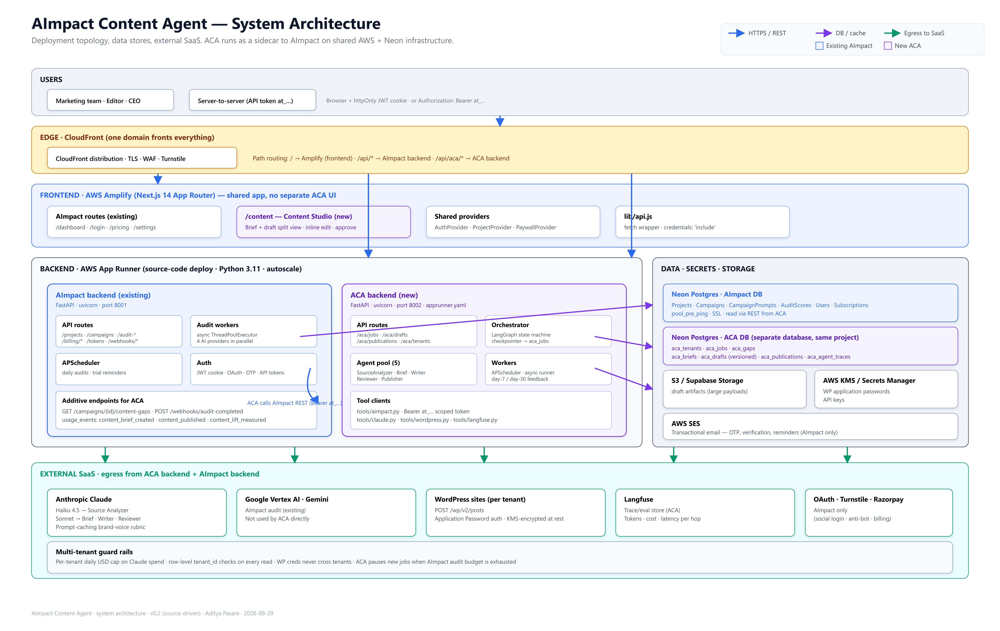

# 03 · System Architecture



## What this diagram shows

The **infrastructure and network topology**. Which cloud services run each component, how traffic flows, where secrets live, how tenants are isolated. The pipeline logic is in [02-workflow.md](02-workflow.md); the boxes here are its physical hosts.

Read the diagram in five horizontal bands: Users → Edge → Frontend → Backend / Data → External SaaS.

---

## Band 1 — Users

Two client kinds:

1. **Human users** (marketing team, editor, CEO) — browser sessions with an httpOnly JWT cookie issued by AImpact. No separate ACA login. Content Studio (`/content`) is served by the same Next.js app on Amplify.
2. **Server-to-server clients** — internal jobs, integrations, and tests calling `/api/aca/*` with `Authorization: Bearer at_...`.

Same auth vocabulary as AImpact, deliberately. Reduces surprise.

---

## Band 2 — Edge (CloudFront)

**One domain fronts everything.** CloudFront distribution with:

- TLS termination (ACM cert).
- WAF ruleset (rate limiting per IP, common OWASP rules).
- Cloudflare Turnstile challenge for anonymous flows (signup, forgot password).

Path-based origins:

| Path | Origin |
|---|---|
| `/` (default) | AWS Amplify (Next.js frontend) |
| `/api/*` | AImpact App Runner service |
| `/api/aca/*` | ACA App Runner service |

The `/api/aca/*` prefix is stripped by the backend before routing (mirrors AImpact's existing `StripApiPrefixMiddleware`). So a request to `https://app.example.com/api/aca/jobs` hits `POST /aca/jobs` on the ACA container.

This routing choice matters because it keeps the browser same-origin. No CORS preflight, no cookie SameSite gymnastics, no separate DNS record.

---

## Band 3 — Frontend (AWS Amplify · Next.js 14 App Router)

Single Next.js app. Existing AImpact routes remain untouched:
- `/dashboard`, `/login`, `/pricing`, `/settings`, `/status`, …

**New for ACA**: `/content` (Content Studio) with three routes:
- `/content` — job queue for the tenant
- `/content/jobs/{id}` — the brief + draft + reviewer notes UI (see workflow doc §Phase E)
- `/content/settings` — tenant WP + Google Ads link status

Shared React context providers (unchanged from AImpact): `AuthProvider`, `ProjectProvider`, `PaywallProvider`. Content Studio consumes all three — it needs the current user, the current project scope, and the current plan (Content pack gate).

`lib/api.js` gets a new base URL fallback: `NEXT_PUBLIC_ACA_API_URL || '/api/aca'`. Every fetch already runs with `credentials: 'include'`, so the ACA endpoints receive the AImpact cookie.

---

## Band 4 — Backend (AWS App Runner)

Two container services side by side.

### AImpact backend (existing, port 8001)

Unchanged except for three small additive endpoints introduced for ACA — see [08-integration-aimpact.md](08-integration-aimpact.md):

- `GET /campaigns/{id}/content-gaps` — ranked prompts.
- `POST /webhooks/audit-completed` — optional push instead of poll.
- Three new `usage_event` types.

The existing audit workers, APScheduler, and auth flows are not touched.

### ACA backend (new, port 8002)

- **API routes** (`aca/api/`) — REST surface.
- **Orchestrator** (`aca/orchestrator/`) — LangGraph state machine with a DB-backed checkpointer.
- **Agent pool** (`aca/agents/`) — five agents (Source Analyzer, Brief, Writer, Reviewer, Publisher).
- **Workers** (`aca/workers/`) — APScheduler nightly picker + day-7/30 feedback.
- **Tool clients** (`aca/tools/`) — AImpact REST, Claude, WordPress, Langfuse. (No Google Ads in v0.2.)

Deployment:
- App Runner source-code deploy (Python 3.11) driven by `apprunner.yaml`. No Docker.
- App Runner service: min 1 instance, max 8, target 70% CPU (adjust after PoC).
- VPC connector: only if we later put Postgres in a private VPC. For Neon (public endpoint, IP-allowlisted), not needed.
- CPU / memory: 1 vCPU, 2 GB baseline. LLM calls are I/O-bound so RAM matters more than CPU.

Health probe: `GET /aca/health`.

---

## Band 5 — Data / Secrets / Storage

### Neon Postgres · AImpact DB
Read-only from ACA's perspective (via REST). Contains Projects, Campaigns, CampaignPrompts, AuditScores, Users, Subscriptions. Same connection pool config as today: `pool_pre_ping=True`, `pool_recycle=300`, SSL required.

### Neon Postgres · ACA DB
Separate database on the **same Neon project** (cheapest way to get logical isolation with shared billing). Contains the 7 `aca_*` tables. Schema managed by Alembic in `aca/db/migrations/`.

Backups: Neon's point-in-time recovery (7 days retention on the free tier, longer on pro). No custom backup scripts needed for v0.1.

### S3 / Supabase Storage
- Large draft artifacts — anything the DB shouldn't hold (attached images, HTML export blobs).

Bucket layout: `aca/{tenant_id}/drafts/{draft_id}/*.png`.

### AWS KMS + Secrets Manager
- **KMS** — customer-managed key (`alias/aca-secrets`) for envelope encryption of tenant credentials in `aca_tenants`.
- **Secrets Manager** — the ACA service's own secrets (Anthropic key, Langfuse keys). Rotated via SM auto-rotation.

Never stored in plaintext, ever, at any point:
- WordPress application passwords
- Anthropic API key (in prod only — dev uses `.env`)

### AWS SES
Transactional email — reused from AImpact. ACA piggybacks for editor-approval reminders and lift-report weekly digest emails.

---

## Band 6 — External SaaS

All egress leaves the ACA container over public internet (no PrivateLink for LLM providers today). Each row is a client in `aca/tools/`.

| Service | Purpose | Auth | Notes |
|---|---|---|---|
| Anthropic Claude | Haiku (Source Analyzer) + Sonnet (Brief/Writer/Reviewer) | API key | Only LLM provider ACA uses. Prompt-cache the brand rubric — ~70% hit target |
| Google Vertex AI · Gemini | AImpact audits (existing) | Service account | Not used by ACA directly |
| WordPress sites (per tenant) | Publish target | Application Password (Basic auth) | KMS-encrypted at rest, HTTPS only |
| Langfuse | Trace + eval store | API key | One span per agent hop |
| Microsoft Clarity | Behavior analytics for AImpact | API key | AImpact only, cached 24h |
| Razorpay | Subscription billing for AImpact | API key + webhook secret | AImpact only |
| OAuth providers (Google, Microsoft, Apple) | Social login | client_id/secret | AImpact only |
| Cloudflare Turnstile | Anti-bot for AImpact signup | site + secret keys | AImpact only |
| OpenTelemetry collector | Metrics/logs/traces sink | mTLS or none inside VPC | Ships to CloudWatch + Langfuse |

---

## Multi-tenant guard rails

- **Per-tenant USD cap** on Claude spend (default $25/day, config `ACA_DAILY_USD_CAP_PER_TENANT`). Enforced in `tools/claude.py` before every call by summing `aca_agent_traces.cost_usd` for the current day.
- **Row-level tenant checks** on every ORM read — enforced in `api/deps.py` via a filter dependency, not by trust.
- **Credential isolation** — WP secrets are keyed by `tenant_id`. Reads never happen without a tenant object in scope.
- **Backpressure into AImpact** — ACA calls `GET /me/audit-budget` before starting a job; if the tenant's audit budget for the day is < the estimated re-audit cost (~2 audits per job over the next 30 days), the job is queued rather than run.

---

## Networking summary

```
Browser ──► CloudFront ──► Amplify (Next.js)              /*
                        └► AImpact App Runner (:8001)     /api/*
                        └► ACA App Runner (:8002)         /api/aca/*
                                    │
                                    ├─► Neon (AImpact DB)  read-only via REST client
                                    ├─► Neon (ACA DB)      SQLAlchemy pool
                                    ├─► S3 / Supabase      boto3
                                    ├─► KMS / Secrets Mgr  boto3
                                    ├─► Anthropic Claude   anthropic SDK
                                    ├─► WordPress (tenant) httpx
                                    └─► Langfuse           langfuse SDK
```

No inbound connections except through CloudFront.
All outbound over HTTPS.

---

## Environments

| Env | Domain | AImpact | ACA | DB |
|---|---|---|---|---|
| dev | localhost / VS Code tunnel | localhost:8001 | localhost:8002 | Neon dev branch or local Postgres |
| staging | app-staging.aimpact.example.com | App Runner (staging) | App Runner (staging) | Neon staging DB |
| prod | app.aimpact.example.com | App Runner (prod) | App Runner (prod) | Neon prod DB, separate DB per tenant tier only if we ever need noisy-neighbor isolation |

Feature flags: `ACA_ENABLED_FOR_TENANT_IDS` env var, comma-separated. PoC = AImpact's own tenant only; beta = 3 pilots.

---

## Observability topology

```
ACA container ─► OTel SDK ─► OTel collector (sidecar in App Runner or ECS)
                                   ├─► CloudWatch Logs (structured JSON)
                                   ├─► CloudWatch Metrics
                                   └─► Langfuse (LLM spans only, sampled)

DB (aca_agent_traces) is the third store — SQL-queryable, joinable with aca_publications for lift attribution.
```

Alarms (v0.1):
- **Cost** — CloudWatch alarm when a tenant's day-so-far spend > 80% of cap.
- **Error rate** — `aca_jobs.status=failed` > 5% of jobs in 1h → PagerDuty.
- **Latency** — p95 job wall-clock > 20 min → warning.
- **Human-blocked** — jobs in `awaiting_human` > 48h → daily digest to tenant editor.

---

## Rollout / capacity plan (PoC)

- **Week 1–4** — internal only. AImpact's own campaigns. 1 App Runner instance is plenty.
- **Week 5–8** — batch mode on 20 AImpact prompts. Still 1 instance; peak concurrency 3.
- **Beta** — 3 pilot customers. Bump max instances to 4. Add per-tenant CloudWatch dashboards.
- **GA** — self-serve. Move to instance-based pricing model in App Runner if request volume warrants; otherwise stay on-demand.

Databases scale independently — Neon autoscales compute; storage grows linearly with drafts (~2 MB per job at 2 KB × 3 draft versions + brief + gaps + traces).

---

## What isn't shown in this diagram

- The **per-request lifecycle inside a container** (middleware stack, auth resolution, DB session per request). That's implicit.
- **CI/CD pipelines** — GitHub Actions matrix, build-and-deploy hooks; documented in [09-deployment.md](09-deployment.md).
- **Disaster recovery** — RPO/RTO, region failover story; that's a v1.0 concern, not v0.1.
