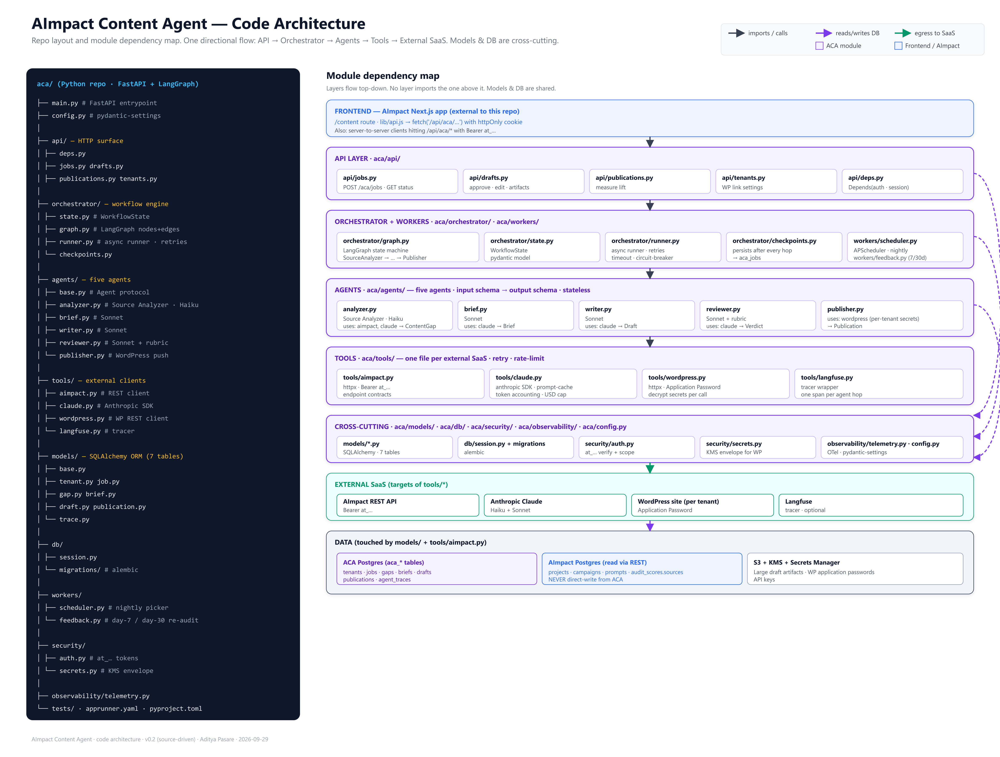

# 04 · Code Architecture



## What this diagram shows

The **repo layout** on the left and the **module dependency map** on the right. Read them together: the tree tells you *where* code lives; the map tells you *what depends on what*.

The organizing principle is a strict downward-only layering:

```
Frontend  →  API  →  Orchestrator + Workers  →  Agents  →  Tools  →  External SaaS
                                     │
                                     └── Models / DB / Security / Observability (cross-cutting)
```

No upward imports. `agents/` cannot import from `orchestrator/`. `tools/` cannot import from `agents/`. Break this rule and layer violations get flagged in CI (`ruff` + a custom `import-linter` config).

---

## Layer 0 — Frontend (external to this repo)

Lives in the AImpact Next.js repo. Two touchpoints matter:

- **`/content` route** — Content Studio. Uses `lib/api.js` and its `fetch('/api/aca/…', { credentials: 'include' })` wrapper. Same auth cookie as AImpact.
- **Server-to-server clients** — anything else in the org hitting `/api/aca/*` with `Authorization: Bearer at_...`.

The frontend never talks to `tools/` or `agents/` directly. Only the API layer.

---

## Layer 1 — API (`aca/api/`)

FastAPI routers. One file per resource. Each router is thin — it validates input, calls an orchestrator or a model, returns a typed response.

| File | Purpose | Key routes |
|---|---|---|
| `api/deps.py` | Shared dependencies: `get_db()`, `get_current_tenant()`. | — |
| `api/jobs.py` | Start / poll / list workflow jobs. | `POST /aca/jobs`, `GET /aca/jobs/{id}`, `GET /aca/jobs/{id}/artifacts` |
| `api/drafts.py` | Editor approval + inline edits. | `POST /aca/drafts/{id}/approve`, `POST /aca/drafts/{id}/edit` |
| `api/publications.py` | Publish history + lift measurement. | `GET /aca/publications`, `POST /aca/publications/{id}/measure` |
| `api/tenants.py` | Tenant-level settings (link WordPress, brand voice, taxonomy). | `GET /aca/tenants/me/settings`, `POST /aca/tenants/me/wordpress`, `POST /aca/tenants/me/brand` |

Full request/response shapes in [07-api-reference.md](07-api-reference.md).

### Auth
`get_current_tenant()` accepts:
- **Cookie session** — reuses AImpact's httpOnly JWT for browser callers.
- **Bearer token** — `at_...` prefix, bcrypt-hashed and prefix-indexed. Verified in `security/auth.py`.

Both paths resolve to a `Tenant` ORM object. If neither header nor cookie is present, `401`.

---

## Layer 2 — Orchestrator (`aca/orchestrator/`)

The workflow engine. Owns the LangGraph state machine, the runner loop, retries, and the DB-backed checkpointer.

| File | Purpose |
|---|---|
| `orchestrator/state.py` | `WorkflowState` pydantic model — the object passed between agents. Also defines the typed IO models: `CitedSource`, `ContentGap`, `Brief`, `Draft`, `Verdict`. |
| `orchestrator/graph.py` | Builds the LangGraph: nodes are agents, edges are transitions, conditional edge from Reviewer implements the revise loop. |
| `orchestrator/runner.py` | Async wrapper — `run_job(job)` orchestrates a full run with timeout, retry, and OTel spans. Called from `api/jobs.py` and from `workers/scheduler.py`. |
| `orchestrator/checkpoints.py` | LangGraph checkpointer implementation backed by `aca_jobs` + `aca_agent_traces`. Job can be resumed from any hop. |

The graph is intentionally boring. It's just: `analyzer → brief → writer → reviewer → (writer|human_gate) → publisher`. All the interesting logic lives in the agents.

---

## Layer 3 — Workers (`aca/workers/`)

Background jobs. Not user-invoked.

| File | Purpose | Schedule |
|---|---|---|
| `workers/scheduler.py` | Nightly picker — scans campaigns whose score is under threshold, enqueues jobs. | `02:00 IST` daily |
| `workers/feedback.py` | Day-7 and day-30 re-audit driver. Calls AImpact's audit trigger, polls, writes lift back. | Triggered per publication, offset from `scheduled_at` |

APScheduler with an `AsyncIOScheduler`, started in `main.py`'s lifespan. Stopped cleanly on shutdown.

---

## Layer 4 — Agents (`aca/agents/`)

Five files, one per agent. Each agent is a stateless async function with the same signature:

```python
async def run(state: WorkflowState) -> WorkflowState: ...
```

Contracts are enforced by pydantic: an agent that fails to produce a valid `ContentGap` raises `ValidationError`, the orchestrator marks the hop as failed, retries.

| File | Reads | Writes to state | Uses tools |
|---|---|---|---|
| `agents/base.py` | Agent protocol + shared LLM prompt utilities | — | — |
| `agents/analyzer.py` | `state.prompts` (with per-model responses + cited sources) | `state.gap` (cited_sources, themes, target_angle, hypothesis) | `tools/aimpact`, `tools/claude` (Haiku) |
| `agents/brief.py` | `state.gap` | `state.brief` | `tools/claude` (Sonnet) |
| `agents/writer.py` | `state.brief` | `state.draft` | `tools/claude` (Sonnet) |
| `agents/reviewer.py` | `state.draft`, `state.brief`, `state.gap.cited_sources` | `state.verdict` | `tools/claude` (Sonnet + rubric) |
| `agents/publisher.py` | `state.draft`, `schedule_at` | `aca_publications` row | `tools/wordpress`, `security/secrets` |

### Testing agents
Every agent has a companion unit test in `tests/unit/test_<agent>.py` with a fixture that stubs the tool clients. Contract tests for LLM outputs use Langfuse recorded runs replayed offline.

---

## Layer 5 — Tools (`aca/tools/`)

External SaaS clients. One file per service. Each has:

- **Retry** — `tenacity` with exponential backoff on 5xx / 429.
- **Rate limit** — token bucket where the provider requires one.
- **Cache** — style-guide prompt cache (24 h) for the Claude client.
- **Cost accounting** — every call logs `(tenant_id, tokens_in, tokens_out, cost_usd)` to `aca_agent_traces`.

| File | Client | Notes |
|---|---|---|
| `tools/aimpact.py` | `httpx.AsyncClient` | Bearer `at_...`, base URL from settings. Contains typed methods for every AImpact endpoint ACA uses. |
| `tools/claude.py` | `anthropic` SDK | Prompt caching for brand-voice rubric. Enforces the per-tenant daily USD cap before every call. |
| `tools/wordpress.py` | `httpx.AsyncClient` | Basic auth with app password decrypted per call via `security/secrets.py`. |
| `tools/langfuse.py` | `langfuse` SDK | One trace per job, one span per agent hop. |
| `tools/source_fetcher.py` | `httpx.AsyncClient` | Bounded public-page fetches for the Source Analyzer verification stage; revalidates redirect destinations and response limits. |

---

## Layer 6 — Cross-cutting

### Models (`aca/models/`)
SQLAlchemy 2.x declarative. One file per table.

| File | Table | Purpose |
|---|---|---|
| `models/base.py` | — | `DeclarativeBase` |
| `models/tenant.py` | `aca_tenants` | One row per AImpact tenant enabled for ACA |
| `models/job.py` | `aca_jobs` | Workflow run |
| `models/gap.py` | `aca_gaps` | Analyzer output (cited sources, themes, angle) |
| `models/brief.py` | `aca_briefs` | Brief agent output |
| `models/draft.py` | `aca_drafts` | Writer + Reviewer output, versioned |
| `models/publication.py` | `aca_publications` | Publisher output + lift metrics |
| `models/trace.py` | `aca_agent_traces` | Per-hop trace |

Full schema in [06-data-model.md](06-data-model.md).

### DB (`aca/db/`)
- `db/session.py` — engine + session factory. `pool_pre_ping=True`, `pool_recycle=300`.
- `db/migrations/` — Alembic. Every schema change ships as a numbered migration; no `Base.metadata.create_all` in prod.

### Security (`aca/security/`)
- `auth.py` — verify `at_...` tokens against bcrypt hashes.
- `secrets.py` — KMS envelope encrypt/decrypt. Reads `AWS_KMS_KEY_ID`, encrypts before insert, decrypts on read. Encrypted values never appear in logs or serialized responses.

### Observability (`aca/observability/`)
- `telemetry.py` — OTel `TracerProvider` + `MeterProvider` setup, OTLP HTTP exporter. Called from `main.py`'s lifespan.

### Config (`aca/config.py`)
Single `Settings` class, `pydantic-settings`. `@lru_cache` on the factory so every module gets the same instance. All env vars declared here — nothing reads `os.environ` directly.

---

## Import rules (enforced)

```
main.py     ─► api/, workers/, observability/
api/        ─► orchestrator/, models/, security/, db/
orchestrator/ ─► agents/, models/, db/
workers/    ─► orchestrator/, models/, tools/aimpact
agents/     ─► tools/, orchestrator/state
tools/      ─► security/, config
models/     ─► db/  (base only), config
db/         ─► config
security/   ─► config
observability/ ─► config
```

- No upward arrows.
- Cross-layer imports at the same level (e.g., `tools/claude` from `tools/langfuse`) are allowed only via a small shared module (`tools/_common.py`).
- Circular imports are a hard error, not a warning.

An `import-linter` config in `pyproject.toml` locks this in.

---

## Testing strategy

```
tests/
├── unit/                # pure functions, agents with tool clients stubbed
│   ├── test_analyzer.py
│   ├── test_brief.py
│   ├── test_writer.py
│   ├── test_reviewer.py
│   └── test_publisher.py
└── integration/         # spins up a Postgres + real tool clients pointed at sandbox
    ├── test_full_job.py     # end-to-end happy path
    ├── test_revise_loop.py
    └── test_recovery.py     # kill mid-run, resume from checkpoint
```

- **Unit** — fast (< 1 s each), no network, tool clients replaced by fixture that returns recorded LLM outputs (Langfuse export).
- **Integration** — real Postgres (local install or Neon dev branch), real Anthropic (with a canary key + cost cap), a hosted WordPress staging site, mocked Google Ads.
- **Contract** — a small suite that pins the AImpact endpoint contracts. Runs against staging in CI weekly. If AImpact's `GET /campaigns/{id}/audit-results` changes shape, this fails before prod does.

---

## Local dev quick reference

```bash
# 1. DB — point at a Neon dev branch, or a locally installed Postgres
#    (Neon dev branches are free and match production exactly.)

# 2. Env
cp .env.example .env
# set DATABASE_URL, AIMPACT_BASE_URL, AIMPACT_API_TOKEN, ANTHROPIC_API_KEY

# 3. Install
python -m venv .venv && source .venv/Scripts/activate
pip install -r requirements.txt

# 4. Migrate + run
alembic upgrade head
uvicorn aca.main:app --reload --port 8002

# 5. Smoke test
curl -H "Authorization: Bearer at_dev_xxx" http://localhost:8002/aca/jobs/ping
```

---

## What's intentionally NOT in the code

- **No CMS logic** — WordPress is the only publish target for v1. Adapters for other CMSs (Webflow, HubSpot, Ghost) live in v1.0 scope, not v0.1.
- **No custom LLM router** — we call Anthropic directly. If we need a fallback provider later, it goes in `tools/` behind the existing interface.
- **No message queue** — job persistence in Postgres + APScheduler is enough for v0.1's expected volume (< 1k jobs/day). SQS/Celery is a v1.0 conversation.
- **No microservices** — one process, one container. Split only when a specific bottleneck justifies the operational cost.

Every one of those "no" choices is documented so the next engineer knows *why* they're not there.
